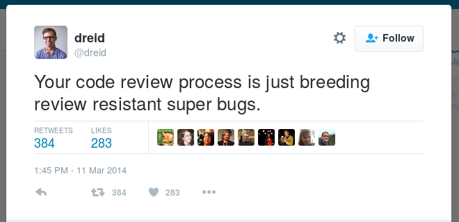

.. Code Review for Operations slides file, created by
   hieroglyph-quickstart on Thu Aug 25 09:25:40 2016.

==========================
Code Review for Operations
==========================

Spencer Krum, IBM

August 26th, 2016

@nibalizer

http://bit.ly/2bl307e

.. note::

   * Who am I
   * What do I work on
   * github
   * published link (bit.ly)

Portland
========

CC BY-SA https://upload.wikimedia.org/wikipedia/commons/f/fa/Portland_and_Mt_Hood.jpg

.. note::

    CC BY-SA https://upload.wikimedia.org/wikipedia/commons/f/fa/Portland_and_Mt_Hood.jpg

Real Portland
=============

Credit: Motherboard/Vice

.. note::

    Fair Use Motherboard/Vice

Things I am Involved In
=======================

* OpenStack
* DevOpsDays PDX
* SeaGL
* Open Infrastructure Day @ SCaLE
* VoxPupuli

OpenStack Code Fast Facts
=========================

* ~600 git repos
* 20k commits / 6 mo
* 100k reviews / 6 mo

.. note::
    * openstack development is freaking huge
    * I work on the testing system
    * Infrastructure admin, release team

Vocab
=====

* Review(noun): A proposed code change
* Change(noun): A proposed code change
* Robot(noun): Some kind of automated process
* Review(verb): A human or robot vote on a change
* Land(verb): A proposed change merging with mainline

Code Review
===========

.. code-block:: shell

   Developing software by proposing changes, then seeking peer review
   and approval of those changes.

.. note::

   * In researching this, I found out a lot of people are doing post-merge big ol read all the code things
   * focus on code review before merge

Code Review
===========

1) Review happens pre merge

2) Approver isn't the author

.. note::

   * sans robots
   * add in robots to test and deploy

Why do People Do Code Review
============================

* Fewer defects
* Developers share knowledge, responsibility
* Limits the impact of a 'Brent'
* Brings up the other developers
* Creates Audit trail
* Encourages 'tests always passing'

.. note::
    * encourages in two ways: 
      1) the test passing is looked at, no more push-thrashing
      2) no one wants to waste other peolpes time, they feel bad
    * the logo for DoD boston is throwing away ego, blame, and slios
    * silos because people can see changes other teams are doing in code review and git history, and positively push or nack those changes
    * blame because whatever was done was done by 2 or 3 team members, no one solo action can cause an outage
    * ego because people will find bugs in your code and point it out, and it very quickly becomes a non issue to take and get that kind of feedback

.. note::
    this is where, if I had my shit together, we would talk about acadmeic research into code review

SuperBugs
=========

.. note::
    Do i need to be fancy with this?

Tools and techniques
====================

Tools:

* Reviewboard
* Gerrit
* GitLab
* Stash
* Github

.. note::

   * Yay OpenSource
   * Ish
   * In order of increasing open source ness
   All:
   * Look at the diff
   * Look at the test results
   Wish:
   * Button to have a spun up docker with the code running
   * Give me a url to hit the api at
   * Give me a python repl or whatever with the library loaded
   What kind of feedback can you give:

   * Some allow you to write messages "Great Patch!"
   * Some allow inline comments
   * some allow you to just approve/merge
   * Robot vs Human feedback
   * Some allow you to vote (grid)
   * Some allow you to block merge
   * +1 vs +2: one is 'this looks good but I am not in the approver group' and the other is 'this looks good an i am in the approver group'

   Post Feedback:

   Author proposes new patchset
   Some systems destroy the original patchset

   Gerrit for instance allows you to see what patchset #3 was, and who said what about it.
   Reviewers can then look at the diff between PS3 and PS4 and do a much quicker review. (I liked the code before, and I just wanted this one thing done, ok that is done now cool +2)

   Access Control

   * Who can comment
   * who can approve
   * Who can rerun the tests
   * Who can block the commit from landing
   * Who can update the commit

   Interaction with other changes

   * Multiple changes can stack 
   * Stack changes against changes proposed to other repositories

Tools and Techniques
====================

Techniques:

* Two Pass System
* First pass: Is there anything obviously wrong with it?
* Second pass: Is this good code?

.. note::

   * Jezz humble 'we cant know it will work, but we can show it has known failures and issues'
   * Second pass is pretty subjective
   * Second pass is an effort spectrum:
     ** you're smart, approved without reading
     ** read and the code looks ok
     ** Look at docs for the libraries in play.. are you using it correctly?
     ** Run the code myself
     ** Try to write it a different way, see if it can be simpler or whatever

Tools and Techniques
====================

Questions to ask:

* Does this conflict with other work going on?
* Does it follow the patterns in the code around it?
* Should this be refactoring code as well?
* Is this patch too big?

Infrastructure as Code
======================

.. code-block:: shell

    Describe your infrastructure with code, track it in git, modify it
    using code review, deploy it with robots.

.. note::

    Joe Damato's talk 'infrastructure as code might be literally impossible'

Infrastructure as Code
======================

Techniques and Technologies

.. note::

   You don't need me to tell you how to do this. There are a million vendors here with solutions for you.
   I use a lot of puppet and ansible. I do some image building as well. Do what works.
   Many people are doing this for not the first time. It's not super great but it works.
   Many of us are also moving to a situation where we abdicate responsibility in a lot of ways and instead spend our time taking care of a scheduler.
   That's not bad, network engineers have been there for a long time, so have people who are responsible for caching and cdn work.

Code Review for Operations
==========================

How does code review change when done to an IoC codebase?

Things we use code review for
=============================

.. rst-class:: build

* Changes to daemons
* Configuration of daemons
* Changing users on servers
* Changing packages, files, services
* Changes to our image builds
* Docs

Things we use code review for
=============================

.. rst-class:: build

* Test definitions
* Creating Git repositories
* ACLs for git
* Registering irc channels
* Mapping 'review created' events to irc channels
* Specifications for future work

Things we use code review for
=============================

.. rst-class:: build

* Candidacy for elected positions
* Mapping between repositories and jobs
* Releases
* Adding new dependencies
* Grafana dashboards
* Meeting calendar

.. note::

   It becomes a lifestyle of reviewing yaml, all day.
   Some of it is minorly important, some of it is hugely important
   A one line config for ops can be exhausting

   With all of these things, multiple eyes adds value, but it costs time
   In some cases we just have rubber stamping 'yep looks good'

   Some of this is really going too far and the bikeshed is painted all the
   colors of the rainbow

The Game
========

* Small patches land, big patches don't
* People beg for reviews
* People will make a plan, write it and land it quickly
* People will learn who the soft touches are, and hassle them
* Lots of time spent reviewing = less patches
* Sprinting + Review workflow = hard
* Chat + Review = odd

.. note:: 

    If the only way to get code into the repository is to get it approved by other people, certain things emerge from that, which then influence behavior.

Code Review for Operations
==========================

.. rst-class:: build

How does code review change when done to an IoC codebase?

* Merge speed is an issue
* Audit ability becomes huge
* Access control moves from unix to your vcs
* Testing will have less coverage
* Small changes can have huge impact -> stressful
* Many approve -> consensus

.. note::

    When shits on fire, we might need to self approve or approve without tests, its the reality

    We prefer to use the system improperly to just going rouge and rooting.

    Spencer Krum Correlarry to Damato's rule: testing infrastructure changes might be litterally impossible

    One line yaml changes can be really scary to approve, for a software dev its like changing the defaults of software, just every day, all day

    What are some of the emergent behaviors?

The Game
========

* 1st Person YOLO
* 2nd Person YOLO

.. note::

    With any 2 person approval proccess this is true, but it is particularly difficult in IoC environments

    1st person can kinda just be like 'sure, looks good' then the second person is the one who is really on the hook for verifying the code before it goes.
    1st person isn't really required to do a deep review, 2nd person is disincentivized from approving second because blowback sorta falls on them

    The opposite can also be true. That second person can be like 'well the author wrote it and the first reviewer liked it so its probably good and WHAM'

    Imagine for a second how bad it can be when these two people meet on a review.

Chickens and Pigs
=================

* Code review for IoC enables Chickens to help

.. note::

    One of the reasons cited for dropping the C&P analogy was it didn't leave room for the knowlegeable expert.

    Having an outside expert propose a patch or review a patch can be extremely useful

    Note that they can have laser focus, so remember that the pigs role is still to take the wide view

    We had our gerrit expert propose a change and we approved it like 'sure buddy', then found out we'd opened up a security vulnerability

WIP Changes
===========

* Changes can be proposed before they are complete

.. note::

    This allows you to get early feedback.
    This allows you to go on vacation and somone else can pick it up

Silence Means No
================

* Consciously skipping over a review is a different kind of -1

.. note::

    Giving a -1 review might be what someone is thinking. But the belief that there are bugs in the thing, or the general
    desire not to have that change in the repository will sometimes be realized as someone just refusing to review a
    change.

    "The direction here is wrong"
    "I don't have time to do it right now but we need to that right"

Forcing the Issue
=================

* Proposing an aggressive change can force the issue

.. note::

    For whatever reason, the team is not agreed on a solution, and pressure is on. One individual or faction wants to
    wait and think, or come up with something elegant. Another wants to quick n dirty.

    The Q&D team can propose that change, then threaten to merge it themselves, or have managers escalate and try to get
    you to do it, or whatever. The point is whomever is resistant to action may be forced to push back hard.

    This can work to your advantage if you're dealing with people who are giving you the 'ignore'.

What's next for code review
===========================

* Full server create/delete
* Finglonger

Finglonger Demo
===============

Fair Use: Fox

Thank You & Questions
=====================

Spencer Krum, IBM

August 26th, 2016

@nibalizer

References
==========

* All OpenStack Infra repos: http://git.openstack.org/cgit/openstack-infra/
* ansible-puppet role: http://git.openstack.org/cgit/openstack-infra/system-config
* Apply test: http://git.openstack.org/cgit/openstack-infra/system-config/tree/tools/apply-test.sh
* OpenStack CI http://docs.openstack.org/infra/openstackci/
* OpenStack Stats: http://stackalytics.com

References
==========

* OpenStack yaml driven grafana: http://grafana.openstack.org/dashboard/db/nodepool-infra-cloud
* Yaml -> grafana tool: https://git.openstack.org/cgit/openstack-infra/grafyaml/
* Adding a Meeting in code review: https://review.openstack.org/#/c/343871/
* Elections in git: https://github.com/voxpupuli/plumbing/blob/master/share/elections/2016-01.md
* Yaml for everything: https://git.openstack.org/cgit/openstack-infra/project-config

References
==========

* Finglonger: https://github.com/nibalizer/finglonger
* This talk: https://github.com/nibalizer/talk-code_review_for_operations

